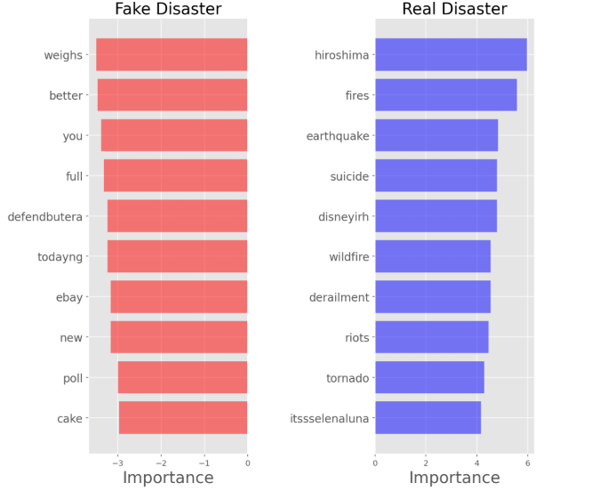
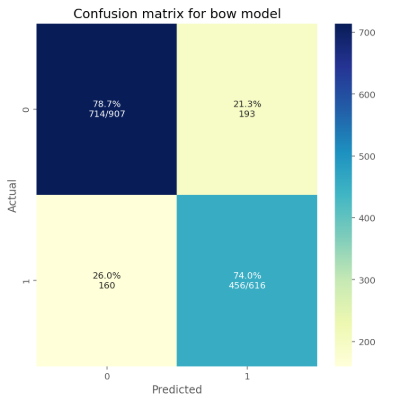
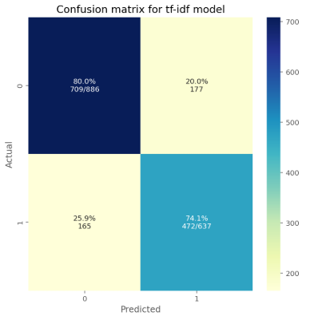
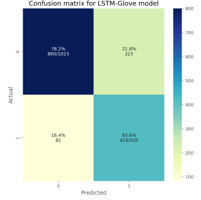
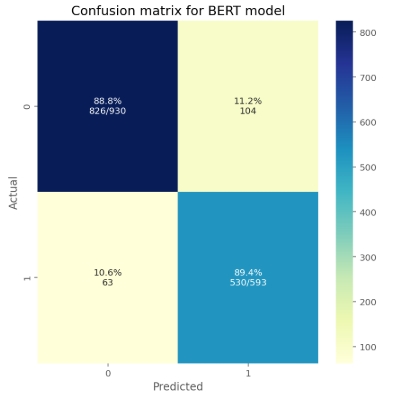
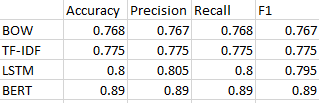

# Fake-or-Not
The dataset includes tweets about disaster e.g., earthquake, wildfire. The objective is to detect if the tweet is about a real diasaster vs fake diasaster. Different approaches have been performed for data cleaning and training the model. The best model can predict real vs fake tweets with 89% accuracy using transfer learning (BERT).

The following models have been developed for training: 
• BOW Model with Logistic Regression. (accuracy 77%) 
• Tf-Idf with Logistic Regression. (accuracy 78%) 
• Word2Vec with LSTM. (accuracy 80%) 
• BERT [BERT-large 24 layer, 1024 hidden, 16 heads] (accuracy 89%) 
 
# Performance
Word Impotance based on Logistic Regression: 

# How to run
Please check realOrFake.ipynb script.

